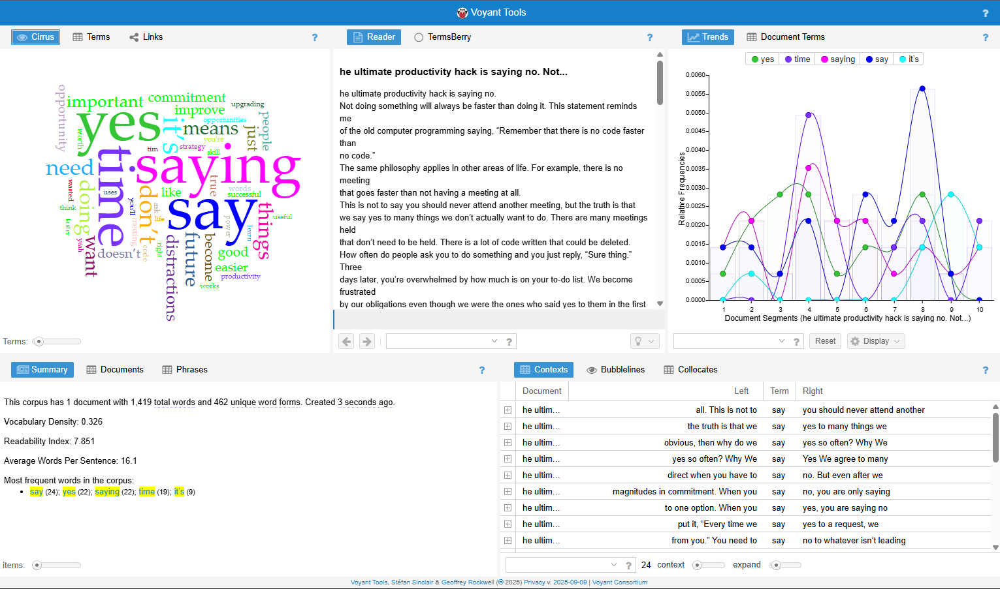



# Distant Reading Assignment 

Below are the responses I got from Voyant and Copilot. 

They analyzed this article: (https://jamesclear.com/saying-no) 

Summary: 

As you can see, the most distinct observation is how different both programs are designed, however, they both clearly gave very different answers. For one, the word counts, and the most common words analyzed were different from both Voyant and Copilot. I will assume Voyant was wrong on this occasion because Copilot found more words and listed them for me. Though when I asked Copilo to give me a vocabulary density and readability index, it gave me very similar answers compared to Voyant. I do find it interesting how different their word count was, and I’m not entirely sure why their answers were so different.  
